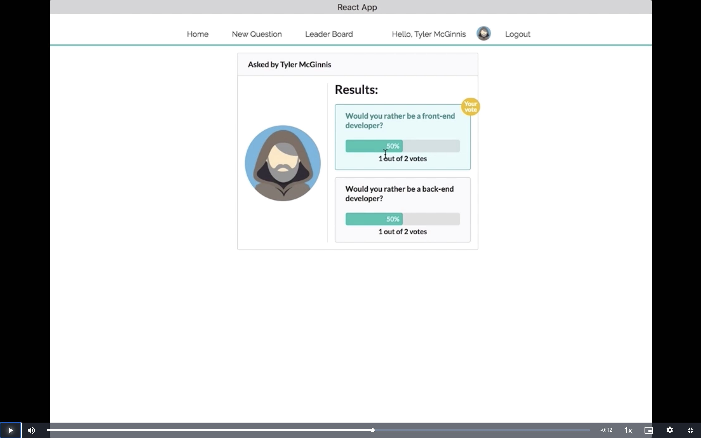
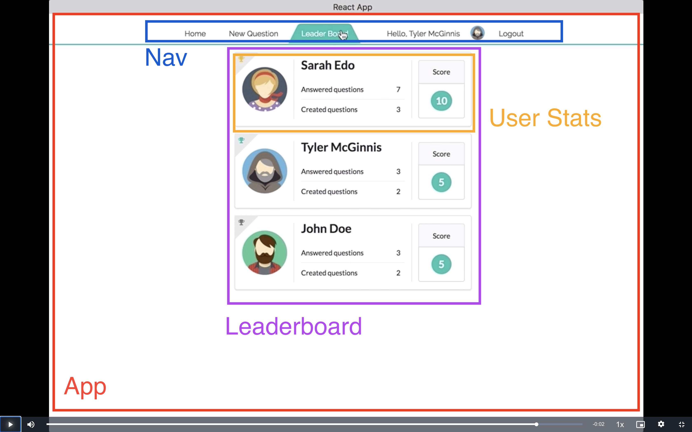

# Project planning

1. Identify What Each View Should Look Like
2. Hierarchy of Components
3. What Events Happen in the App
4. What Data Lives in the Store

## Identify What Each View Should Look Like

### Signin

This view allows signin (enter app) via authenticated users (authUsers).


Signin View Requirements:

- located at the route (/sign-in)
- list of authUsers and a way of selecting one of them
- clicking signin should route to the home page (/) with the selected authUser

### Home

This view (Home) shows two lists of questions: answered and unanswered.


Home View Requirements:

- located at the route (/)
- List of answered and unanswered questions (by authUser)
- The unanswered questions are shown by default
- The questions do not show the full details
- The questions show a "View Poll" button, clicking this routes (/questions/:question_id) and the Question view
- The questions are arranged from the most recently created (top) to the least recently created (bottom).

Each question will show:

- text: "authUser asks"
- Avatar image of the AuthUser who posted the polling question
- first 15 characters of first question option prefixed and suffixed with "...", ie: "...write JavaScrip..."
- Button with text "View Poll"

### Question

The view displaying a question: unanswered


Question View Requirement (unanswered)

- located at the route (/questions/:question_id)
- Text “Would You Rather”;
- Avatar image of the AuthUser who posted the polling question
- Two options (radio buttons)
- Submit button would show question as answered and display the answered view

The view displaying a question: (answered)



Question View Requirements:

- located at the route (/questions/:question_id)
- the text of the option
- the number of people who voted for that option
- the percentage of people who voted for that option
- the option the logged in authUser voted for (your vote)

### New question

The view to create a new question.


New Question View Requirements:

- located at the route (/add)
- includes text: complete the question
- includes text: Would you rather ...
- Two text fields with text in between: Or
  - First with placeholder text: Enter option one text here
  - Second with placeholder text: Enter option two text here
- Submit button
- Upon submitting the form, a new poll is created and the user is taken to the home page.

### Leaderboard

This view displays a list of authUsers with a scoring system.


Leaderboard View Requirements:

- located at the route (/leaderboard)
- Each entry on the leaderboard contains the following:
  - the user’s name;
  - the user’s picture;
  - the number of questions the user asked; and
  - the number of questions the user answered.
  - Users are ordered in descending order based on the sum of the number of questions they’ve answered and the number of questions they’ve asked.

## Hierarchy of components for each view

### Login View


- **App** - the overall container for the project
- **Navigation** - displays the navigation
- **SignIn** - displays a form to select a authUser and enter the app

### Home View


- **App** - the overall container for the project
- **Navigation** - displays the navigation
- **Question List**
  - responsible for the entire list of questions
  - sorted by date and answered/unanswered
- **Question** - shows a tease/part of the the question, user and a way to see the full question

### Question View


- **App** - the overall container for the project
- **Navigation** - displays the navigation
- **Question Detail** - displays the content for a single question. The question can be answered or unanswered.

### Create Question View


- **App** - the overall container for the project
- **Navigation** - displays the navigation
- **Create Question** - display the form to create a new question

### Leaderboard View



- **App** - the overall container for the project
- **Navigation** - displays the navigation
- **Leaderboard** - displays a list of users and ordered them by score.
- **User Stats** - displays the statistics of a user (answered/created question).

### All Components

The application will have the following components:

- App
- Navigation
- SignIn
- Question List
- Question
- Question Detail
- Create Question
- Leaderboard
- User Stats

## What Events Happen in the App

### SignIn Component


For the Signin component we need a list of users and by selecting a user with will set the user and authedUser and navigate to the Question list component.

- Connected component (users, authedUser)

### Question List Component


- we'll need to get a list of all of the questions. So for this component, we just need to: `_getQuestions()`
- We get the authedUser (user that is currently logged in) so we can sort the questions by the ones they have answered and those they have not.

So the action type for event this will probably be something like **GET_LIST_OF_QUESTIONS** or **GET_DATA**.

- Connected component (questions, authedUser)

### Question Component


- We get a particular question from a list of questions.
- We get the author of the specific question as we need the author name and avatar image

- Connected component (questions, users)

### Question Detail Component

- We get a specific Question from a list of questions.
- We get the author of the specific question as we need the author name and avatar image

If the authedUser is not in the `voteArray`


- we will need the author user to get the author's name and avatar.
- they can answer the question (vote).
- answering the question will use the method `_saveQuestionAnswer`
- once the answer is saved the screen will show the results

If the authedUser is in the `voteArray`


- they can see their chosen answer and the number of people who voted for both options and the percentage of people who voted for the options is shown
- we can use the `voteArray` to tally a percentage for each option.

```
"8xf0y6ziyjabvozdd253nd": {
  id: "8xf0y6ziyjabvozdd253nd",
  author: "sarahedo",
  timestamp: 1467166872634,
  optionOne: {
    votes: ["sarahedo"],
    text: "have horrible short term memory",
  },
  optionTwo: {
    votes: [],
    text: "have horrible long term memory",
  },
},
```

- Connected component (questions, users, authedUser)

### Create Question Component


- We get the authedUser so the user can create a new question.
- We set the text options of the new question.
- We need to call the `_saveQuestion` method here.
- Connected component (questions, authedUser)

### Leaderboard Component


- We need to get the list of users for this component.
- We need to sort the list of users by the sum of `answers` and `questionsArray`
- Connected component (users)

```
users = {
  sarahedo: {
    id: "sarahedo",
    name: "Sarah Edo",
    avatarURL: "../../images/snow.jpg",
    answers: {
      "8xf0y6ziyjabvozdd253nd": "optionOne",
      "6ni6ok3ym7mf1p33lnez": "optionOne",
      am8ehyc8byjqgar0jgpub9: "optionTwo",
      loxhs1bqm25b708cmbf3g: "optionTwo",
    },
    questions: ["8xf0y6ziyjabvozdd253nd", "am8ehyc8byjqgar0jgpub9"],
  },
}
```

### User Stats Component


- As we are sorting the list users in the Leaderboard component, we can just pass the specific information
  (name, answered questions, created questions and total) to this User stats component.

## What Data Lives in the Store

According to the Redux documentation, here are the principles of state normalization:

- Each type of data gets its own "table" in the state.
- Each "data table" should store the individual items in an object, with the IDs of the items as keys and the items themselves as the values.
- Any references to individual items should be done by storing the item's ID.
- Arrays of IDs should be used to indicate ordering.

Looking at our initial question and user data:

```
let questions = {
  "8xf0y6ziyjabvozdd253nd": {
    id: "8xf0y6ziyjabvozdd253nd",
    author: "sarahedo",
    timestamp: 1467166872634,
    optionOne: {
      votes: ["sarahedo"],
      text: "have horrible short term memory",
    },
    optionTwo: {
      votes: [],
      text: "have horrible long term memory",
    },
  },
}

let users = {
  sarahedo: {
    id: "sarahedo",
    name: "Sarah Edo",
    avatarURL: "../../images/snow.jpg",
    answers: {
      "8xf0y6ziyjabvozdd253nd": "optionOne",
      "6ni6ok3ym7mf1p33lnez": "optionOne",
      am8ehyc8byjqgar0jgpub9: "optionTwo",
      loxhs1bqm25b708cmbf3g: "optionTwo",
    },
    questions: ["8xf0y6ziyjabvozdd253nd", "am8ehyc8byjqgar0jgpub9"],
  }
}
```

In our application, normalized state would look like this:

```
{
  questions: {
    questionId: {
      author,
      questionId
      optionOne: { votesArray, text }
      optionTwo: { votesArray, text }
      timestamp
    }
  },
  users: {
    userId: {
      answers: { questionId: {} }
      avatarURL,
      userId,
      name,
      questionsArray
    }
  },
  authedUser: userId,
  loadingBar
}
```

Because the user is (mocked) logged in and the we need this authedUser when we create a question, vote on at question and sort questions on the home page, we will need to add the authUser to the store.

Another reason we would want to keep the authedUser piece of data in the store is that we can logout and change the authedUser.

### The Store contains:

- **tweets property**
- **users property**
- **authedUser property**.
- **loadingBar property**.

Our connected components are:
- **SignIn** (users, authedUser)
- **Question List** (questions, authedUser)
- **Question** (questions, users)
- **Question Detail** (questions, users, authedUser)
- **Create Question** (questions, authedUser)
- **Leaderboard** (users)

### Local state

Our local state could be used in the `Create Question` component for user input when completing the form. It could also be used in the `Question List` component to toggle (tab: show/hide) the lists of `answered` and `unanswered` questions, this state is not needed else where and so is a good candidate for local state.


