# Would You Rather Project

This is the starter code for the final assessment project for Udacity's React & Redux course.

The `_DATA.js` file represents a fake database and methods that let you access the data. The only thing you need to edit in the `_DATA.js` file is the value of `avatarURL`. Each user should have an avatar, so you’ll need to add the path to each user’s avatar.

Using the provided starter code, you'll build a React/Redux front end for the application. We recommend using the [Create React App](https://github.com/facebook/create-react-app) to bootstrap the project.

## Data

There are two types of objects stored in our database:

- Users
- Questions

### Users

Users include:

| Attribute | Type   | Description                                                                                                                                                                                                    |
| --------- | ------ | -------------------------------------------------------------------------------------------------------------------------------------------------------------------------------------------------------------- |
| id        | String | The user’s unique identifier                                                                                                                                                                                   |
| name      | String | The user’s first name and last name                                                                                                                                                                            |
| avatarURL | String | The path to the image file                                                                                                                                                                                     |
| questions | Array  | A list of ids of the polling questions this user created                                                                                                                                                       |
| answers   | Object | The object's keys are the ids of each question this user answered. The value of each key is the answer the user selected. It can be either `'optionOne'` or `'optionTwo'` since each question has two options. |

### Questions

Questions include:

| Attribute | Type   | Description                            |
| --------- | ------ | -------------------------------------- |
| id        | String | The question’s unique identifier       |
| author    | String | The author’s unique identifier         |
| timestamp | String | The time when the question was created |
| optionOne | Object | The first voting option                |
| optionTwo | Object | The second voting option               |

### Voting Options

Voting options are attached to questions. They include:

| Attribute | Type   | Description                                                        |
| --------- | ------ | ------------------------------------------------------------------ |
| votes     | Array  | A list that contains the id of each user who voted for that option |
| text      | String | The text of the option                                             |

Your code will talk to the database via 4 methods:

- `_getUsers()`
- `_getQuestions()`
- `_saveQuestion(question)`
- `_saveQuestionAnswer(object)`

1. `_getUsers()` Method

_Description_: Get all of the existing users from the database.  
_Return Value_: Object where the key is the user’s id and the value is the user object.

2. `_getQuestions()` Method

_Description_: Get all of the existing questions from the database.  
_Return Value_: Object where the key is the question’s id and the value is the question object.

3. `_saveQuestion(question)` Method

_Description_: Save the polling question in the database.  
_Parameters_: Object that includes the following properties: `author`, `optionOneText`, and `optionTwoText`. More details about these properties:

| Attribute     | Type   | Description                                |
| ------------- | ------ | ------------------------------------------ |
| author        | String | The id of the user who posted the question |
| optionOneText | String | The text of the first option               |
| optionTwoText | String | The text of the second option              |

_Return Value_: An object that has the following properties: `id`, `author`, `optionOne`, `optionTwo`, `timestamp`. More details about these properties:

| Attribute | Type   | Description                                                                                                                  |
| --------- | ------ | ---------------------------------------------------------------------------------------------------------------------------- |
| id        | String | The id of the question that was posted                                                                                       |
| author    | String | The id of the user who posted the question                                                                                   |
| optionOne | Object | The object has a text property and a votes property, which stores an array of the ids of the users who voted for that option |
| optionTwo | Object | The object has a text property and a votes property, which stores an array of the ids of the users who voted for that option |
| timestamp | String | The time when the question was created                                                                                       |

4. `_saveQuestionAnswer(object)` Method

_Description_: Save the answer to a particular polling question in the database.
_Parameters_: Object that contains the following properties: `authedUser`, `qid`, and `answer`. More details about these properties:

| Attribute  | Type   | Description                                                                             |
| ---------- | ------ | --------------------------------------------------------------------------------------- |
| authedUser | String | The id of the user who answered the question                                            |
| qid        | String | The id of the question that was answered                                                |
| answer     | String | The option the user selected. The value should be either `"optionOne"` or `"optionTwo"` |

## Contributing

This repository is the starter code for _all_ Udacity students. Therefore, we most likely will not accept pull requests. For details, check out [CONTRIBUTING.md](https://github.com/udacity/reactnd-project-would-you-rather-starter/blob/master/CONTRIBUTING.md).

## Project planning

1. Identify What Each View Should Look Like
2. Hierarchy of Components
3. What Events Happen in the App
4. What Data Lives in the Store

### Identify What Each View Should Look Like

#### Signin

This view allows signin (enter app) via authenticated users (authUsers).


Signin View Requirements:

- located at the route (/sign-in)
- list of authUsers and a way of selecting one of them
- clicking signin should route to the home page (/) with the selected authUser

#### Home

This view (Home) shows two lists of questions: answered and unanswered.


Home View Requirements:

- located at the route (/)
- List of answered and unanswered questions (by authUser)
- The unanswered questions are shown by default
- The questions do not show the full details
- The questions show a "View Poll" button, clicking this routes (/questions/:question_id) and the Question view
- The questions are arranged from the most recently created (top) to the least recently created (bottom).

Each question will show:

- text: "authUser asks"
- Avatar image of the AuthUser who posted the polling question
- first 15 characters of first question option prefixed and suffixed with "...", ie: "...write JavaScrip..."
- Button with text "View Poll"

#### Question

The view displaying a question: unanswered


Question View Requirement (unanswered)

- located at the route (/questions/:question_id)
- Text “Would You Rather”;
- Avatar image of the AuthUser who posted the polling question
- Two options (radio buttons)
- Submit button would show question as answered and display the answered view

The view displaying a question: (answered)


Question View Requirements:

- located at the route (/questions/:question_id)
- the text of the option
- the number of people who voted for that option
- the percentage of people who voted for that option
- the option the logged in authUser voted for (your vote)

#### New question

The view to create a new question.


New Question View Requirements:

- located at the route (/add)
- includes text: complete the question
- includes text: Would you rather ...
- Two text fields with text in between: Or
  - First with placeholder text: Enter option one text here
  - Second with placeholder text: Enter option two text here
- Submit button
- Upon submitting the form, a new poll is created and the user is taken to the home page.

#### Leaderboard

This view displays a list of authUsers with a scoring system.


Leaderboard View Requirements:

- located at the route (/leaderboard)
- Each entry on the leaderboard contains the following:
  - the user’s name;
  - the user’s picture;
  - the number of questions the user asked; and
  - the number of questions the user answered.
  - Users are ordered in descending order based on the sum of the number of questions they’ve answered and the number of questions they’ve asked.

### Hierarchy of components for each view

#### Login View


- **App** - the overall container for the project
- **Navigation** - displays the navigation
- **SignIn** - displays a form to select a authUser and enter the app

#### Home View

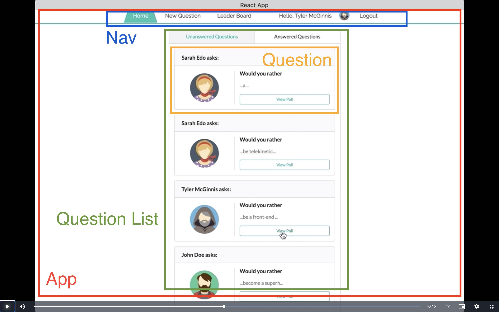

- **App** - the overall container for the project
- **Navigation** - displays the navigation
- **Question List**
  - responsible for the entire list of questions
  - sorted by date and answered/unanswered
- **Question** - shows a tease/part of the the question, user and a way to see the full question

#### Question View

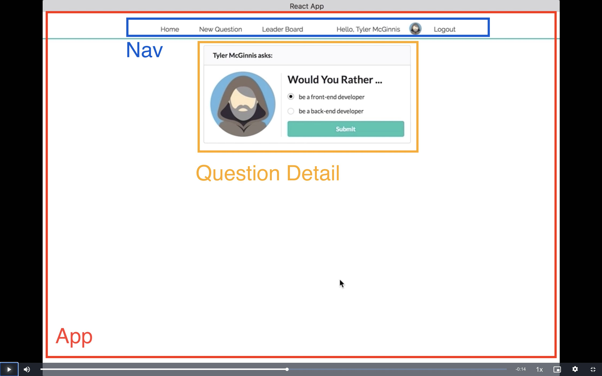
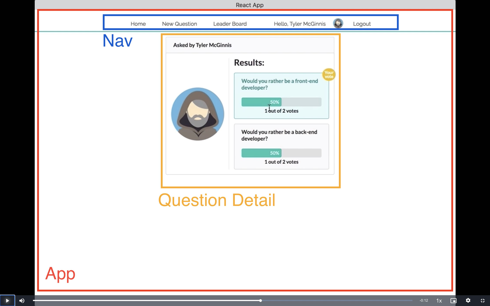

- **App** - the overall container for the project
- **Navigation** - displays the navigation
- **Question Detail** - displays the content for a single question. The question can be answered or unanswered.

#### Create Question View

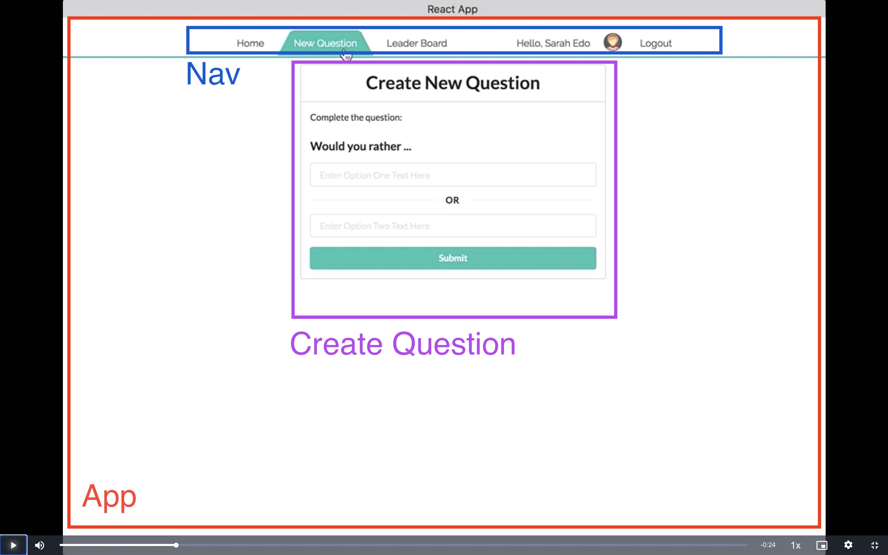

- **App** - the overall container for the project
- **Navigation** - displays the navigation
- **Create Question** - display the form to create a new question

#### Leaderboard View

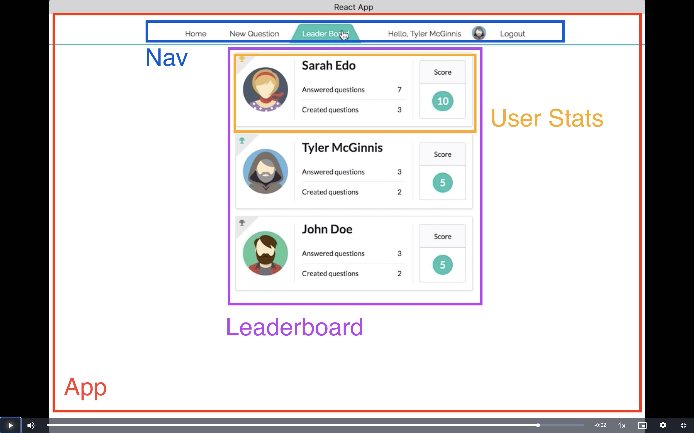

- **App** - the overall container for the project
- **Navigation** - displays the navigation
- **Leaderboard** - displays a list of users and ordered them by score.
- **User Stats** - displays the statistics of a user (answered/created question).

#### All Components

The application will have the following components:

- App
- Navigation
- SignIn
- Question List
- Question
- Question Detail
- Create Question
- Leaderboard
- User Stats


### What Events Happen in the App

#### SignIn Component

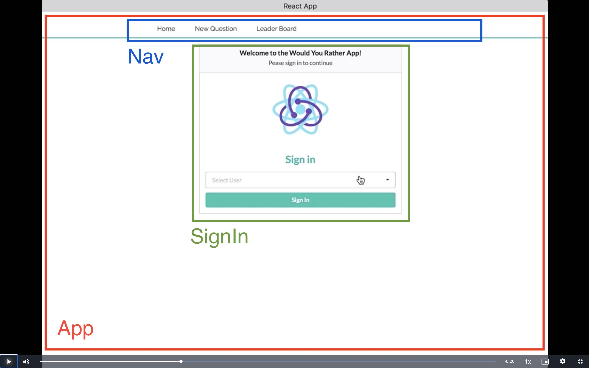

For the Signin component we need a list of users and by selecting a user with will set the user and authedUser and navigate to the Question list component.

#### Question List Component

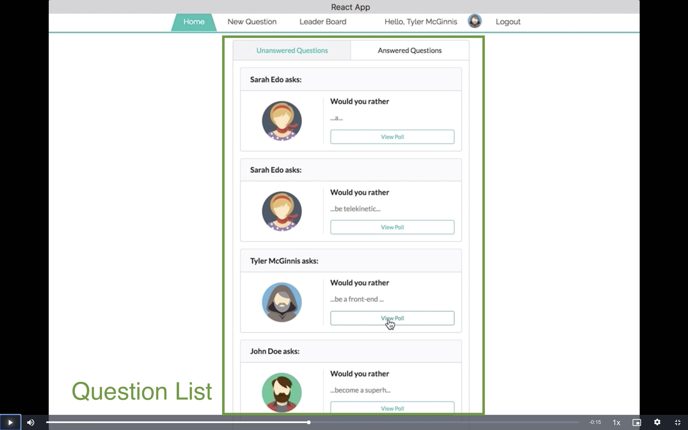

- we'll need to get a list of all of the questions. So for this component, we just need to: `_getQuestions()`
- We get the authedUser (user that is currently logged in) so we can sort the questions by the ones they have answered and those they have not.

So the action type for event this will probably be something like **GET_LIST_OF_QUESTIONS** or **GET_DATA**.


#### Question Component

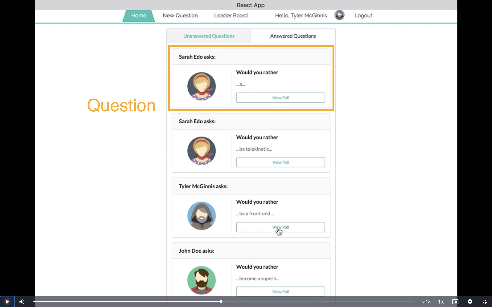

- We get a particular question from a list of questions.
- We get the author of the specific question as we need the author name and avatar image


#### Question Detail Component

- We get a specific Question from a list of questions.
- We get the answer to a specific question from a list of questions.
- We get the author of the specific question as we need the author name and avatar image

If there is no answer from the authedUser

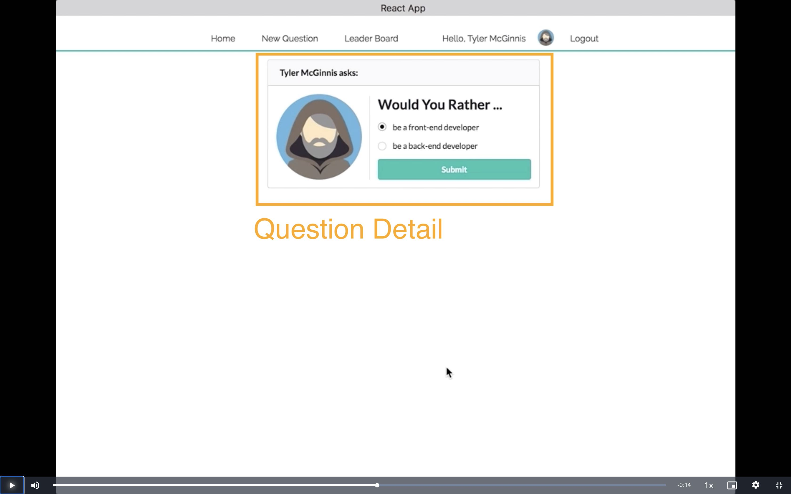

  - they can answer the question.
  - answering the question will use the method `_saveQuestionAnswer`
  - once the answer is saved the screen will show the results 


If there is an answer from the authedUser

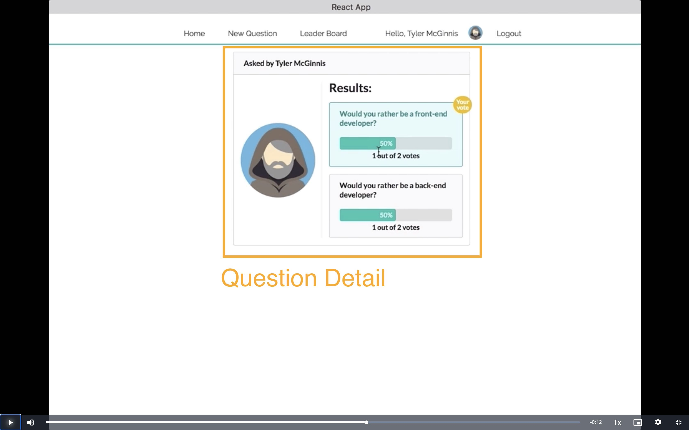

- then they can see their chosen answer and the number of people who voted for both options and the percentage of people who voted for the options is shown
- we will need all the users data so we can collect the answers from the other users and tally a percentage.

```
users = {
  sarahedo: {
    answers: {
      "8xf0y6ziyjabvozdd253nd": "optionOne",
      "6ni6ok3ym7mf1p33lnez": "optionOne",
    },
  },
  tylermcginnis: {
    answers: {
      vthrdm985a262al8qx3do: "optionOne",
      xj352vofupe1dqz9emx13r: "optionTwo",
    },
  }
}
```


#### Create Question Component

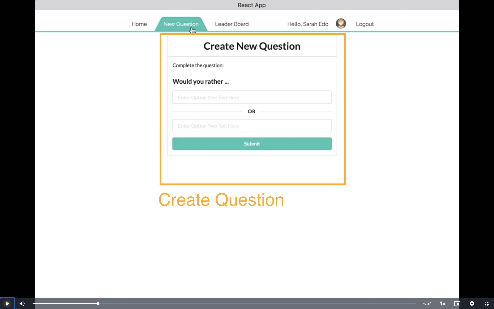

- We get the authedUser so the user can create a new question.
- We set the text options of the new question.
- We need to call the `_saveQuestion` method here.


#### Leaderboard Component

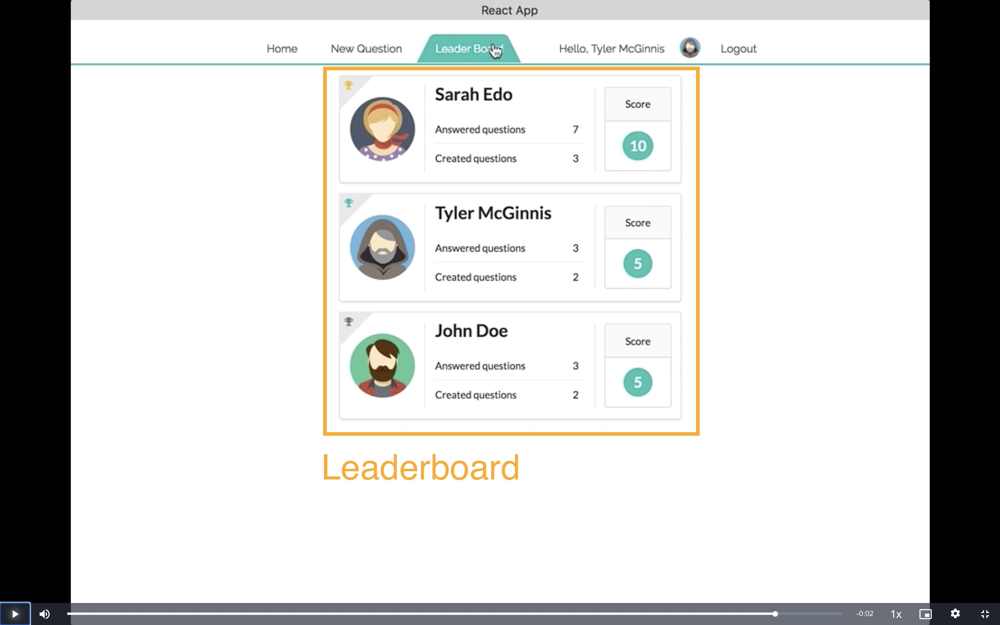

- We need to get the list of users for this component.
- We need to sort the list of users by the sum of answer questions and questions created


#### User Stats Component

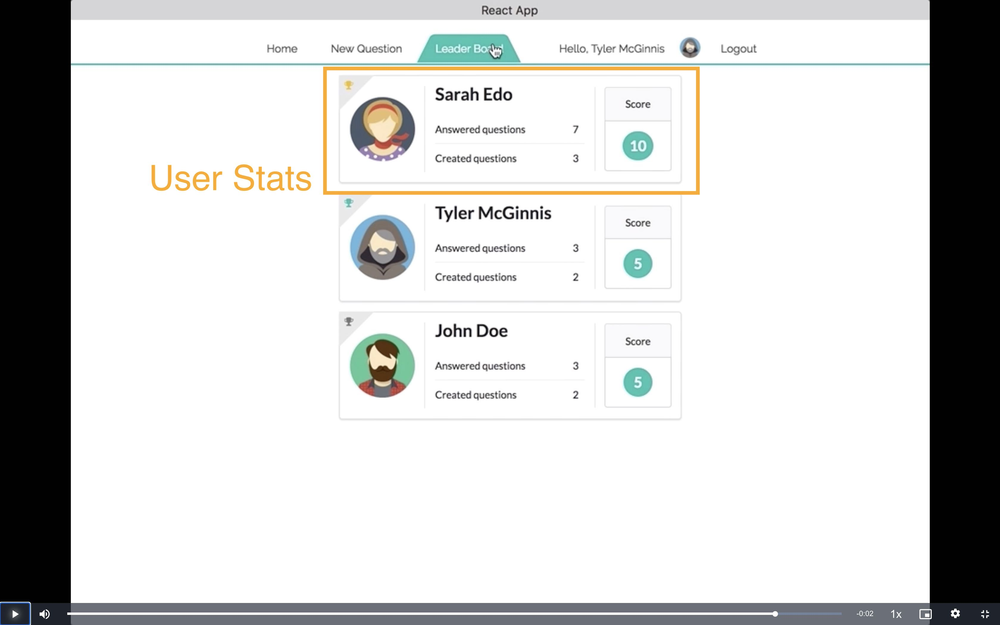

- As we are sorting the list users in the Leaderboard component, we can just pass the specific information 
(name, answered questions, created questions and total) to this User stats component.