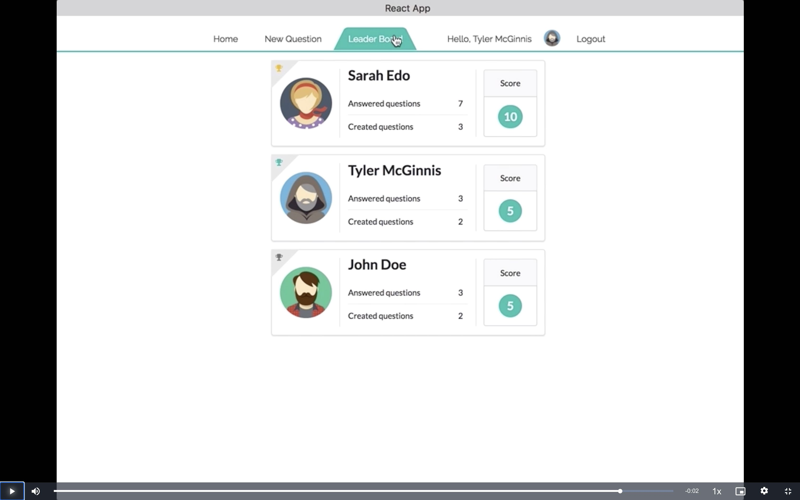

# Would You Rather Project

This is the starter code for the final assessment project for Udacity's React & Redux course.

The `_DATA.js` file represents a fake database and methods that let you access the data. The only thing you need to edit in the `_DATA.js` file is the value of `avatarURL`. Each user should have an avatar, so you’ll need to add the path to each user’s avatar.

Using the provided starter code, you'll build a React/Redux front end for the application. We recommend using the [Create React App](https://github.com/facebook/create-react-app) to bootstrap the project.

## Data

There are two types of objects stored in our database:

- Users
- Questions

### Users

Users include:

| Attribute | Type   | Description                                                                                                                                                                                                    |
| --------- | ------ | -------------------------------------------------------------------------------------------------------------------------------------------------------------------------------------------------------------- |
| id        | String | The user’s unique identifier                                                                                                                                                                                   |
| name      | String | The user’s first name and last name                                                                                                                                                                            |
| avatarURL | String | The path to the image file                                                                                                                                                                                     |
| questions | Array  | A list of ids of the polling questions this user created                                                                                                                                                       |
| answers   | Object | The object's keys are the ids of each question this user answered. The value of each key is the answer the user selected. It can be either `'optionOne'` or `'optionTwo'` since each question has two options. |

### Questions

Questions include:

| Attribute | Type   | Description                            |
| --------- | ------ | -------------------------------------- |
| id        | String | The question’s unique identifier       |
| author    | String | The author’s unique identifier         |
| timestamp | String | The time when the question was created |
| optionOne | Object | The first voting option                |
| optionTwo | Object | The second voting option               |

### Voting Options

Voting options are attached to questions. They include:

| Attribute | Type   | Description                                                        |
| --------- | ------ | ------------------------------------------------------------------ |
| votes     | Array  | A list that contains the id of each user who voted for that option |
| text      | String | The text of the option                                             |

Your code will talk to the database via 4 methods:

- `_getUsers()`
- `_getQuestions()`
- `_saveQuestion(question)`
- `_saveQuestionAnswer(object)`

1. `_getUsers()` Method

_Description_: Get all of the existing users from the database.  
_Return Value_: Object where the key is the user’s id and the value is the user object.

2. `_getQuestions()` Method

_Description_: Get all of the existing questions from the database.  
_Return Value_: Object where the key is the question’s id and the value is the question object.

3. `_saveQuestion(question)` Method

_Description_: Save the polling question in the database.  
_Parameters_: Object that includes the following properties: `author`, `optionOneText`, and `optionTwoText`. More details about these properties:

| Attribute     | Type   | Description                                |
| ------------- | ------ | ------------------------------------------ |
| author        | String | The id of the user who posted the question |
| optionOneText | String | The text of the first option               |
| optionTwoText | String | The text of the second option              |

_Return Value_: An object that has the following properties: `id`, `author`, `optionOne`, `optionTwo`, `timestamp`. More details about these properties:

| Attribute | Type   | Description                                                                                                                  |
| --------- | ------ | ---------------------------------------------------------------------------------------------------------------------------- |
| id        | String | The id of the question that was posted                                                                                       |
| author    | String | The id of the user who posted the question                                                                                   |
| optionOne | Object | The object has a text property and a votes property, which stores an array of the ids of the users who voted for that option |
| optionTwo | Object | The object has a text property and a votes property, which stores an array of the ids of the users who voted for that option |
| timestamp | String | The time when the question was created                                                                                       |

4. `_saveQuestionAnswer(object)` Method

_Description_: Save the answer to a particular polling question in the database.
_Parameters_: Object that contains the following properties: `authedUser`, `qid`, and `answer`. More details about these properties:

| Attribute  | Type   | Description                                                                             |
| ---------- | ------ | --------------------------------------------------------------------------------------- |
| authedUser | String | The id of the user who answered the question                                            |
| qid        | String | The id of the question that was answered                                                |
| answer     | String | The option the user selected. The value should be either `"optionOne"` or `"optionTwo"` |

## Contributing

This repository is the starter code for _all_ Udacity students. Therefore, we most likely will not accept pull requests. For details, check out [CONTRIBUTING.md](https://github.com/udacity/reactnd-project-would-you-rather-starter/blob/master/CONTRIBUTING.md).

## Project planning

1. Identify What Each View Should Look Like
2. Hierarchy of Components
3. What Events Happen in the App
4. What Data Lives in the Store

### Identify What Each View Should Look Like

#### Signin

This view allows signin (enter app) via authenticated users (authUsers).

Signin View Requirements:

- located at the route (/sign-in)
- list of authUsers and a way of selecting one of them
- clicking signin should route to the home page (/) with the selected authUser

#### Home

This view (Home) shows two lists of questions: answered and unanswered.

Home View Requirements:

- located at the route (/)
- List of answered and unanswered questions (by authUser)
- The unanswered questions are shown by default
- The questions do not show the full details
- The questions show a "View Poll" button, clicking this routes (/questions/:question_id) and the Question view
- The questions are arranged from the most recently created (top) to the least recently created (bottom).

Each question will show:

- text: "authUser asks"
- Avatar image of the AuthUser who posted the polling question
- first 15 characters of first question option prefixed and suffixed with "...", ie: "...write JavaScrip..."
- Button with text "View Poll"

#### Question

The view displaying a question: unanswered

Question View Requirement (unanswered)

- Text “Would You Rather”;
- Avatar image of the AuthUser who posted the polling question
- Two options (radio buttons)
- Submit button would show question as answered and display the answered view

The view displaying a question: (answered)

Question View Requirements:

- located at the route (/questions/:question_id)

#### New question

The view to create a new question.

New Question View Requirements:

- located at the route (/add)

#### Leaderboard

This view displays a list of authUsers with a scoring system.

Leaderboard View Requirements:

- located at the route (/leaderboard)
